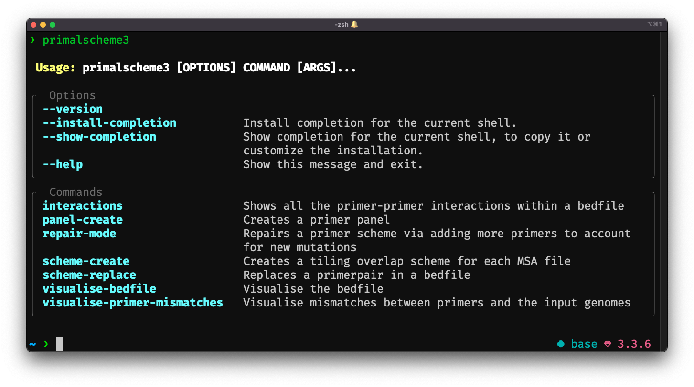

# Introduction

PrimalScheme3 is a tool designed to generate the primers required for a tiling amplicon (ARTIC style) primer schemes.

A web version of the tool is available [here](https://primalscheme.com). 


## Installation 

PrimalScheme3 is available on PyPi

```bash
pip install primalscheme3
```

Can also be  built from source (using poetry).
```bash
git clone https://github.com/ChrisgKent/primalscheme3
cd primalscheme3
```

It can also be run as a docker image (TODO). 
```bash
docker pull chriken/primalscheme3:latest
```


## Simple use cases

### Input files
Say you want to create a primer scheme to be able to sequence an organism. The first step is to get representative, high quality genomes of the thing you want to sequence.  

Once downloaded these genomes need to be aligned into an Multiple Sequence Alignment (MSA) in fasta format.

Next you need to select a primary reference. This is the genome that the primer will in the indexing system of, conventionally, this should be a reference genome, but it is not a requirement. This is done by making it the first genome in the MSA, as shown below.

```bash
>NC_001498.1
...
>PP101943.1
...
```
>In this example the primary reference will be `NC_001498.1`. 

### Running PrimalScheme3




PrimalScheme3 has two main modes; creating schemes and panels, please see the relevant pages for a detailed view, but simply; 

- A scheme is a classical overlapping scheme across the entire genome(s)

- A panel targets specified regions of the genome(s).

```bash
primalscheme3 scheme-create --msa example.fasta --output example_out --amplicon-size 400 --n-pools 2 
```

This will create a titling scheme using 400bp amplicons in 2 pool.


### Output files

The main output files are all written to the `--output` directory.

- `primer.bed`: The main file containing the sequence and location of the primers in the primary reference. 

- `reference.fasta`: The primary reference.

There are also a couple figures to help understand the scheme.

- `plot.html`: An interactive plot showing how the primers tile across the genome.

- `primer.html`: A heatmap showing how well the primers match to the template.


